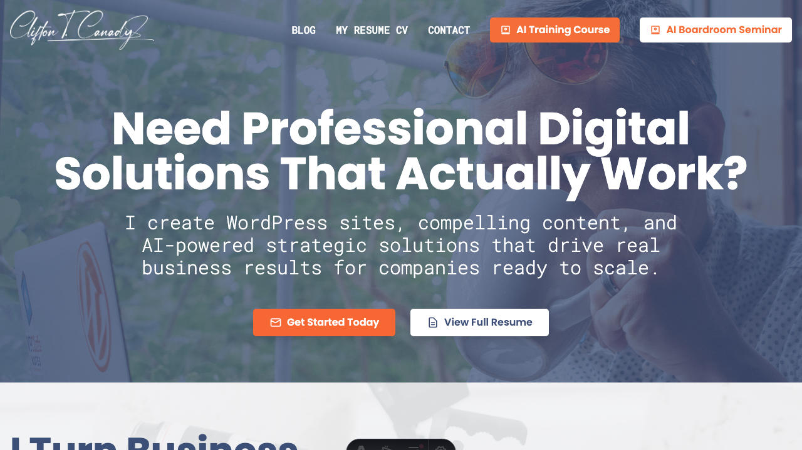

# Clifton T. Canady - Personal Brand Website

A professional personal brand website showcasing expertise in WordPress development, content writing, speaking/seminars, and photography. Built with Astro and shadcn/ui following the StoryBrand messaging framework.

## About

Multi-disciplinary digital professional and AI trainer specializing in:
- **WordPress Development** - Custom sites, themes, plugins, e-commerce
- **Content Writing** - SEO content, copywriting, blog writing, technical writing
- **Speaking & Seminars** - Keynotes, workshops, corporate training
- **AI Training** - Multiple courses and seminars on AI implementation and strategy
- **Photography** - Corporate, events, headshots, product photography

With 20+ years of experience in web development and content creation, plus 24+ years in customer service, I specialize in WordPress development, strategic AI consulting, compelling copywriting, professional photography, and engaging presentations. I help businesses break through growth plateaus with proven digital solutions and AI-powered strategic planning.

**Contact**: 1 (864) 252-2349 | https://cliftoncanady.com/

## 🎨 Brand Guidelines

### Brand Colors
- **Primary Blue**: #1E40AF
- **Secondary Blue**: #3B82F6  
- **Light Blue**: #DBEAFE
- **Accent Orange**: #F59E0B
- **Dark Gray**: #374151
- **White**: #FFFFFF
- **Light Gray**: #F9FAFB

### Design Principles
- **StoryBrand Framework**: Position customer as hero, business as guide
- **Two-page approach**: Homepage (StoryBrand) + Resume (detailed professional info)
- **Mobile-first responsive design**
- **Performance optimization** (target: <2s load time, >95 Lighthouse score)

## 📚 Learn More

- [Astro Documentation](https://docs.astro.build)
- [shadcn/ui Documentation](https://ui.shadcn.com)
- [Tailwind CSS Documentation](https://tailwindcss.com)
- [GSAP Documentation](https://greensock.com/docs)
